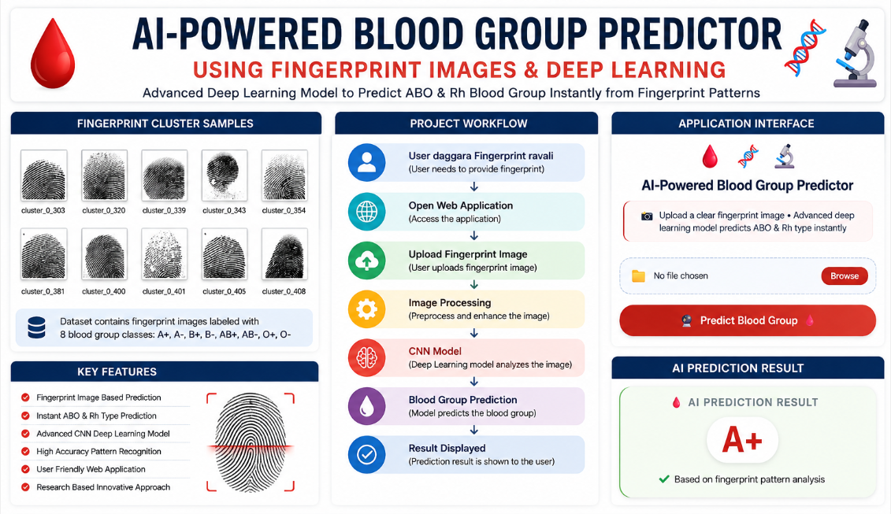

# AI-Based-Blood-Group-Prediction-Using-Fingerprint-Images-with-Deep-Learning
AI-based blood group prediction using fingerprint images and Deep Learning, with a proposed approach for quick access to verified blood group information during emergency situations.
# AI-Based Blood Group Prediction Using Fingerprint Images with Deep Learning

## 📌 Project Overview

This project is based on a research paper that explores the possible relationship between fingerprint patterns and blood groups.

The main idea of this project is to investigate whether meaningful patterns exist between fingerprint images and blood groups and whether Deep Learning can be used to learn these patterns.

A Convolutional Neural Network (CNN) is used to train a model using fingerprint images associated with blood group labels. After training, a new fingerprint image can be provided as input to the application, and the trained model predicts the corresponding blood group.

This project is developed for academic and research purposes to explore and experimentally test this concept.

---

## 🔬 Research Background

The project is inspired by research that investigates the possible relationship between fingerprint patterns and blood groups.

Our project does not claim that a fingerprint can already be used as a medically approved replacement for clinical blood group testing.

Instead, the purpose of this project is to use Deep Learning and CNN techniques to experimentally investigate whether fingerprint images contain meaningful patterns that can be learned by a model and used for blood group prediction.

---

## 🎯 Main Objective

The main objective of this project is to explore the use of Deep Learning with fingerprint images to study the possible relationship between fingerprint patterns and blood groups.

The project aims to:

- Collect fingerprint images with corresponding blood group labels.
- Preprocess the fingerprint images.
- Train a Convolutional Neural Network (CNN).
- Allow the model to learn patterns from fingerprint images.
- Test the trained model using new fingerprint images.
- Observe whether the model can predict the corresponding blood group.
- Explore the possibility of using this concept for faster access to blood group information in future applications.

  ## 📊 Dataset

The dataset used for this project consists of fingerprint images organized into 8 blood-group classes:

- A+
- A-
- AB+
- AB-
- B+
- B-
- O+
- O-

The fingerprint images are arranged into separate folders based on their corresponding blood-group labels. This folder structure is used by TensorFlow's `ImageDataGenerator` for loading and preprocessing the images during CNN training.

### Dataset Preparation

- Fingerprint images are resized to **128 × 128 pixels**.
- Pixel values are normalized using **rescaling (1./255)**.
- The dataset is divided into:
  - **80% training data**
  - **20% validation data**
- The images are used as labeled inputs for training the Convolutional Neural Network (CNN).

---

## 💡 Why Did We Choose This Project?

Blood group identification is important, especially during emergency situations.

Traditional blood group testing generally requires a blood sample, laboratory procedures, equipment, and trained personnel.

Through this research-based project, we wanted to explore whether fingerprint images could be used with Artificial Intelligence and Deep Learning to investigate the possibility of predicting blood groups.

This project also helped us gain practical knowledge in:

- Artificial Intelligence
- Deep Learning
- Convolutional Neural Networks
- Image Processing
- Computer Vision
- Python
- TensorFlow
- Keras
- Flask Web Development

---

.
## 🖼️ Project Overview

  

## 🔮 Future Scope & Proposed Idea

Our idea is that if **fingerprint images and verified blood group information are collected from people across villages and cities**, a large labeled dataset can be created to train a **Deep Learning model**.

In the future, each person's fingerprint can be linked to a **unique identification number**, similar to an Aadhaar number, and the data can be stored securely in a **centralized database**.

In emergency situations, an **authorized user** can enter the unique ID on a website to quickly retrieve the person's **blood group and other relevant information**.

This proposed system aims to provide **fast, secure, and efficient access to blood group details when needed**, especially during emergency situations.

> **Note:** This represents the **future scope and proposed idea of our project**. The current project is primarily developed to study and demonstrate the possible relationship between fingerprint patterns and blood groups using Deep Learning.
